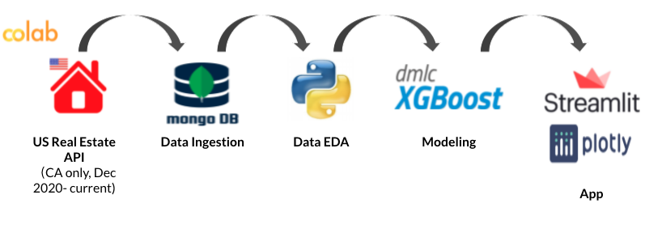

# Data Engineering: Housing Comparison Analysis Dashboard
Wenting Deng

##Abstract
The U.S. housing market has become "outrageous" since 2020. The listing price are meaningless, and the bidding wars are intense in many places, such as the Bay Area in California. In order to make competitive offers, buyer agents always run comparative market analysis to help their clients estimate home values based on recent sold in the same area. Therefore, the goal of this project is to create a comparative market analysis dashboard as an open source for home buyers which enables them to run the analysis by themselves. The data I worked with came from [US Real Estate API](https://rapidapi.com/datascraper/api/us-real-estate/). Through this API, I was able to pull 79,654 sold listings from Dec 2020 to Jul 2021, and 76,055 active listings in California. On the dashboard, users can pull listing information of the property they're interested in, as well as recent sold properties in the same neighborhood. The dashboard also leverages XGboost to predict percentages over/below asking price to estimate the property's sold price.

##Design
This project could enable prospective home buyers to run comparative analysis by themselves, and they don't need to always rely on their agents. They can also compare different regions at the same time to find their next "dream home" more efficiently.

##Data
The data I worked with came from [US Real Estate API](https://rapidapi.com/datascraper/api/us-real-estate/). Through this API, I was able to pull 79,654 sold listings from Dec 2020 to Jul 2021, and 76,055 active listings in California. (Because the API allows certain amount of requests each month, I only requested listing data in California.)

##Algorithms/Tools
* Source Data: US Real Estate API
* Database: Mongodb
* Cloud: colab
* Data EDA: pandas, numpy
* Modeling: XGboost
* Dashboard: Streamlit
* Data Visualization: Plotly

**Pipeline Overview**

## Communication
In addition to the slides and visuals presented, it will be embedded on my analytic blog.
